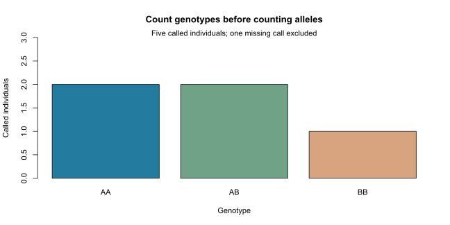

# From genotypes to allele frequencies


This is a self-contained base-R teaching example. It does not call a scientific
gpop API; those interfaces remain proposed. No external data or simulation
is required, and the website displays the code without executing it.

Learn to count alleles at one diploid biallelic locus, report the missing-call
denominator, and distinguish genotype frequencies from allele frequencies.
No Hardy-Weinberg assumption is needed for these observed summaries.

## The data and counted allele

The six hypothetical individuals have A-copy dosages `2, 1, NA, 0, 1, 2`.
Here `2 = AA`, `1 = AB`, `0 = BB`; `NA` is an unobserved genotype, not `BB`.
These labels express allele identity, not dominance or which allele is minor.
The calculation treats each called individual equally and assumes diploidy.

## Work through the calculation

```r
# One diploid biallelic locus; dosage counts copies of allele A.
dosage <- c(2L, 1L, NA_integer_, 0L, 1L, 2L)
called <- dosage[!is.na(dosage)]
stopifnot(length(called) > 0L, all(called %in% 0:2))

counts <- c(AA = sum(called == 2L),
            AB = sum(called == 1L), BB = sum(called == 0L))
n_called <- length(called)
n_missing <- sum(is.na(dosage))
genotype_frequencies <- counts / n_called
p_A <- sum(called) / (2 * n_called)
p_B <- 1 - p_A
H_observed <- unname(genotype_frequencies["AB"])

# Reverse the counted allele without changing the individuals.
dosage_B <- 2L - dosage
p_B_recounted <- sum(dosage_B, na.rm = TRUE) / (2 * n_called)
reference <- list(counts = counts, n_called = n_called,
                  n_missing = n_missing, p_A = p_A, p_B = p_B,
                  genotype_frequencies = genotype_frequencies,
                  H_observed = H_observed, p_B_recounted = p_B_recounted)
```

Five genotypes are called: two AA, two AB and one BB. They contain six A
copies among ten called allele copies, giving the following results:

| Quantity | Value |
| --- | --- |
| Called / missing individuals | 5 / 1 |
| Genotype frequencies AA, AB, BB | 0.4, 0.4, 0.2 |
| Allele frequencies A, B | 0.6, 0.4 |
| Observed heterozygosity | 0.4 |



Dividing by all six individuals would count a missing genotype as two known
allele copies. This example excludes missing calls; it does not impute them
or establish that the missingness mechanism is ignorable for population inference.

## Reverse the counted allele

`2 - dosage` counts B rather than A. The allele frequency changes to 0.4;
the heterozygote proportion stays 0.4. A marker's identity and its counted
allele must therefore travel together when results are exchanged.

## Mathematical extension

For called counts $n_{AA}, n_{AB}, n_{BB}$ and
$n=n_{AA}+n_{AB}+n_{BB}$,

$$
\hat p_A = \frac{2n_{AA}+n_{AB}}{2n},
\qquad H_O = \frac{n_{AB}}{n}.
$$

These are descriptive sample statistics. A standard error or population-level
interpretation needs a sampling model, including how relatives, groups and
missing calls were sampled. An all-missing locus has no called denominator;
its allele frequency is undefined, rather than zero.

## Try it yourself

1. Replace the missing call with AB. What changes in both denominators?
2. Replace every called genotype with AA. What are the allele frequencies and
   observed heterozygosity?
3. Why does reversing the counted allele leave observed heterozygosity unchanged?

**Check your answers:** after replacing NA with AB, $p_A=7/12$ and $H_O=1/2$.
For five AA calls, $p_A=1$, $p_B=0$, and $H_O=0$. Reversal exchanges the two
homozygote labels but leaves AB unchanged.

Continue with [Hardy-Weinberg expectations](hwe-expectations.md).

## Run the complete example

Copy the R code above into RStudio, or source the installed example:

```r
source(system.file("examples", "allele_frequencies.R",
                   package = "gpop", mustWork = TRUE))
reference
plot_tutorial()
```

The complete [R script](../../inst/examples/allele_frequencies.R) includes the plotting
helper. From a cloned repository, it can also be sourced directly from
`inst/examples/allele_frequencies.R`. The small helper exists only in the teaching script;
it is not exported by the package. The static figure is reproduced from that
script using the developer instructions in the [website guide](../../website/README.md).
