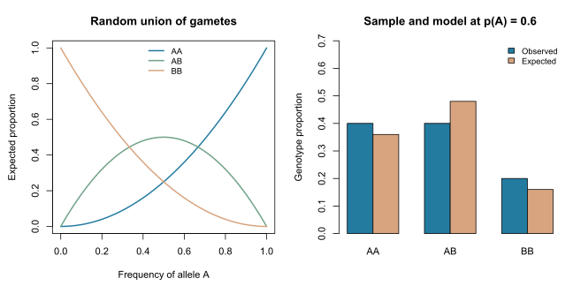

# Hardy-Weinberg expectations


This is a self-contained base-R teaching example. It does not call a scientific
gpop API; those interfaces remain proposed. No external data or simulation
is required, and the website displays the code without executing it.

Learn how supplied allele frequencies determine genotype expectations under
random union of gametes, and why comparing a sample with those expectations
is different from testing equilibrium.

Start with [allele frequencies](allele-frequencies.md). This example uses the
same called counts: two AA, two AB and one BB, with $\hat p_A=0.6$.

## A model for genotype proportions

If each gamete carries A with probability $p$ and B with probability $q=1-p$,
and the two gametes forming a diploid genotype are independent, the expected
proportions are $p^2$, $2pq$ and $q^2$.
This is a model statement; it does not force a finite sample to have exactly
those proportions. [National Research Council, population genetics](https://www.ncbi.nlm.nih.gov/books/NBK232608/)

## Work through the calculation

```r
# Observed counts from five called diploid individuals.
counts <- c(AA = 2L, AB = 2L, BB = 1L)
n_called <- sum(counts)
p_A <- unname((2 * counts["AA"] + counts["AB"]) / (2 * n_called))
q_B <- 1 - p_A

observed <- counts / n_called
expected <- c(AA = p_A^2, AB = 2 * p_A * q_B, BB = q_B^2)
expected_counts <- n_called * expected
H_observed <- unname(observed["AB"])
H_expected <- unname(expected["AB"])

p_grid <- seq(0, 1, length.out = 101L)
curves <- cbind(AA = p_grid^2, AB = 2 * p_grid * (1 - p_grid),
                BB = (1 - p_grid)^2)
reference <- list(p_A = p_A, observed = observed, expected = expected,
                  expected_counts = expected_counts,
                  H_observed = H_observed, H_expected = H_expected,
                  p_grid = p_grid, curves = curves)
```

| Genotype | Observed count | Observed proportion | Expected proportion | Expected count |
| --- | ---: | ---: | ---: | ---: |
| AA | 2 | 0.40 | 0.36 | 1.8 |
| AB | 2 | 0.40 | 0.48 | 2.4 |
| BB | 1 | 0.20 | 0.16 | 0.8 |

Expected counts are averages under a model, so they can be fractional.
Do not round them to manufacture an expected sample.



The observed heterozygosity is 0.40 and the plug-in expected heterozygosity is
0.48. Here the same five individuals supplied the allele-frequency estimate
and the observed counts. The comparison is descriptive; it is not a test
statistic calibrated under a declared sampling model.

## Mathematical extension

The expected proportions sum to $(p+q)^2=1$. Expected heterozygosity,
$H_E=2p(1-p)$, reaches its maximum of $1/2$ at $p=1/2$ and is zero at either
monomorphic endpoint.

The random-union calculation describes one generation at supplied frequencies.
Maintaining allele frequencies across generations requires additional
conditions about evolutionary change. Population mixtures, related sampling,
genotyping errors and other processes can affect an observed comparison;
an observed deficit alone does not identify its cause or establish pedigree
or IBD inbreeding. No HWE test or inbreeding estimator is implemented here.

## Try it yourself

1. Set $p_A=0.5$. What proportions does the model predict?
2. Reverse the counted allele. Which two expected proportions exchange places?
3. Why is a chi-squared reference approximation a poor automatic choice for
   this five-individual example?

**Check your answers:** proportions at 0.5 are 0.25, 0.50 and 0.25. Allele
reversal exchanges AA and BB, while AB is unchanged. Several expected counts
are very small; a formal assessment would require an appropriate test and
sampling contract instead of this descriptive calculation.

## Run the complete example

Copy the R code above into RStudio, or source the installed example:

```r
source(system.file("examples", "hwe_expectations.R",
                   package = "gpop", mustWork = TRUE))
reference
plot_tutorial()
```

The complete [R script](../../inst/examples/hwe_expectations.R) includes the plotting
helper. From a cloned repository, it can also be sourced directly from
`inst/examples/hwe_expectations.R`. The small helper exists only in the teaching script;
it is not exported by the package. The static figure is reproduced from that
script using the developer instructions in the [website guide](../../website/README.md).
